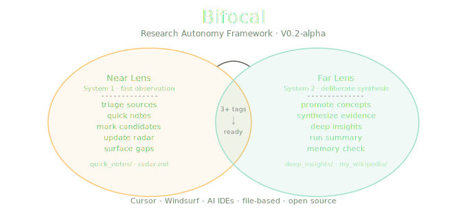

# Bifocal

An agentic research framework inspired by Kahneman's fast and slow thinking.

Bifocal gives an AI agent a pair of research lenses: one for fast observation, one for deeper synthesis. Instead of treating the agent as a simple input-output machine, Bifocal gives it a way to read messy sources, build memory, notice gaps, and slow down before making claims.

| Lens | Mode | Job | Writes To |
| --- | --- | --- | --- |
| Near Lens | Fast | Triage, observe, note signals, find gaps | `quick_notes/`, `radar.md` |
| Far Lens | Slow | Compare sources, test assumptions, synthesize | `deep_insights/`, `my_wikipedia/` |


## Start Here

```text
1. Add sources to sources/
2. Add optional questions to my_questions.txt
3. Tell your AI agent to use .agent/protocol.md
4. Ask it to "Run Bifocal"
5. Read run_summary.md first
```

Suggested agent instruction:

```text
Use .agent/protocol.md as your operating protocol. Run Bifocal: inspect sources, read my_questions.txt as optional steering input, update quick_notes, my_wikipedia, and radar.md as appropriate, and only synthesize when the focus is ready or I ask for Far Lens.
```

## Why This Exists

Most AI research sessions are too flat.

| Usual AI Flow | Bifocal Flow |
| --- | --- |
| User asks a question | User gives questions, sources, or both |
| Agent answers | Agent reads, triages, and builds research memory |
| Reasoning disappears | Evidence trail stays visible |
| Everything becomes Q&A | Questions become part of a larger research ecosystem |

Bifocal is for moments when the user drops in mixed sources and expects the agent to behave like a careful researcher:

- PDFs,
- preprints,
- blog posts,
- Wikipedia pages,
- copied notes,
- peer-reviewed papers,
- messy or incomplete source sets.

The framework helps the agent ask: what is trustworthy, what is missing, what is ready, and what should not be synthesized yet?

## What Bifocal Maintains

| Path | Purpose |
| --- | --- |
| `sources/` | Raw inputs |
| `my_questions.txt` | Simple user question inbox |
| `quick_notes/` | Short Near Lens notes from individual sources |
| `my_wikipedia/` | Durable concept wiki |
| `radar.md` | Questions, gaps, contradictions, and synthesis candidates |
| `deep_insights/` | Far Lens synthesis |
| `run_summary.md` | What happened, what is ready, what is blocked |
| `mistakes.md` | Caught reasoning drift |
| `.agent/protocol.md` | Agent operating protocol |

## The Research Loop

The agent runs Bifocal in this order:

1. Read the user's questions.
2. Inspect the source folder.
3. Triage source quality.
4. Write quick source notes.
5. Mark concept candidates.
6. Promote only important concepts into the wiki.
7. Update the radar.
8. Synthesize only when the evidence is ready.
9. End with a run summary.

This keeps observation, concepts, and conclusions separate.

## Source Triage

Before trusting a source, the agent checks:

| Question | Why It Matters |
| --- | --- |
| What kind of source is this? | A paper, blog post, review, primary text, and preprint are not equal. |
| Who wrote it, and from where? | Author and institutional context affect trust. |
| Does it show evidence or just assert? | Claims need support inside the source. |

This step is small on purpose. It is enough to stop bad sources from silently becoming strong evidence.

## Concept Wiki

`my_wikipedia/` is not a glossary. It is the agent's durable memory for concepts that matter.

A concept gets promoted when:

- it appears in multiple independent sources,
- it is central to a user question,
- it is needed for Far Lens synthesis,
- or the user asks for it.

Example concept pages:

| Domain | Concepts |
| --- | --- |
| World models | `world-model`, `latent-imagination` |
| Nudging economics | `nudge`, `choice-architecture`, `publication-bias` |
| Bronze Age collapse | `late-bronze-age-collapse`, `palatial-economy`, `sea-peoples` |
| Reversible computing | `reversible-computing`, `landauers-principle`, `stochastic-thermodynamics` |

## Tested Domains

Bifocal has been tested on four different research areas.

| Domain | Folder | What It Proved |
| --- | --- | --- |
| World models | `examples/world_models/` | Can synthesize AI papers while leaving unsupported LLM claims open |
| Nudging economics | `examples/nudging_economics/` | Can handle ethics, meta-analysis, and publication-bias conflict |
| Bronze Age collapse | `examples/bronze_age_collapse/` | Can avoid single-cause historical explanations |
| Reversible computing | `examples/reversible_computing/` | Can separate theory, hardware claims, and thermodynamic limits |

## What Happened In The Tests

### World Models

Worked:

- Built a definition of world models.
- Synthesized the Dreamer research line.
- Kept LLM-specific claims open when the sources did not support them.

Still open:

- Add LLM-specific sources.
- Run a deeper limitations pass.

### Nudging Economics

Worked:

- Built pages for nudges, choice architecture, and publication bias.
- Synthesized definition, taxonomy, ethics, failure modes, and effectiveness.
- Surfaced the Mertens versus Maier conflict.

Still open:

- Add implementation case studies.
- Add later evidence on publication bias.
- Add long-term welfare evidence.

### Bronze Age Collapse

Worked:

- Treated collapse as a regional transformation, not one event.
- Synthesized climate, trade, migration, warfare, and political fragility as cascading stresses.
- Kept Sea Peoples claims under review.

Still open:

- Add primary texts.
- Build a region-by-region chronology.
- Add trade-network evidence.

### Reversible Computing

Worked:

- Separated logical reversibility, invertible logic, and thermodynamic reversibility.
- Explained why Landauer's principle matters but is not a full energy model.
- Left adiabatic and quantum comparisons open until better sources are added.

Still open:

- Add Bennett, Fredkin, Toffoli, and reversible circuit synthesis sources.
- Add adiabatic and quantum computing sources.
- Add system-level energy benchmarks.

## Folder Layout

```text
/
|-- .agent/
|   `-- protocol.md
|-- sources/
|-- my_questions.txt
|-- quick_notes/
|-- my_wikipedia/
|-- deep_insights/
|-- examples/
|-- radar.md
|-- run_summary.md
|-- mistakes.md
|-- init.sh
`-- README.md
```

## Create A New Bifocal Project

Run:

```bash
./init.sh
```

Or choose a target folder:

```bash
./init.sh path/to/project
```

The initializer creates the scaffold and protocol files. It does not overwrite an existing `my_questions.txt`.

## Design Principles

- Borrow from Kahneman's fast and slow thinking, but keep the workflow practical.
- Make the agent inspect evidence before synthesis.
- Keep raw sources, quick notes, concepts, and conclusions separate.
- Treat questions as steering signals, not the whole system.
- Promote concepts sparingly.
- Surface missing evidence clearly.
- Keep the framework small enough to inspect.
- Use plain, grounded language.
- Do not use em dash characters.

## Status

Bifocal is ready to ship as a practical framework for AI-assisted research workflows.

It is not a substitute for expert review. It should not be used unattended for high-stakes medical, legal, financial, or safety-critical research.
